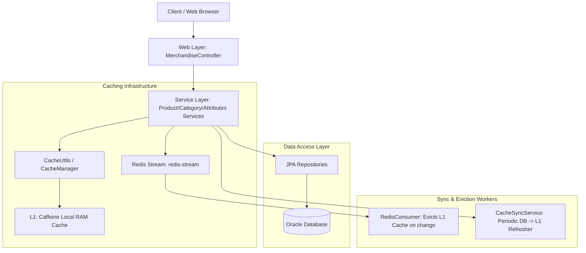
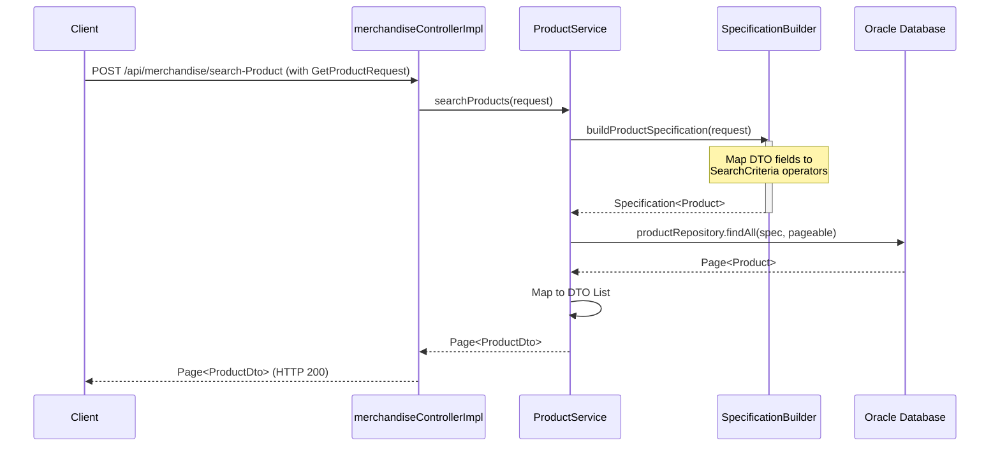
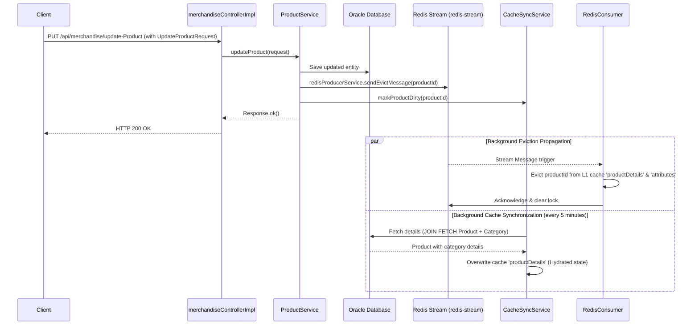

# Catalog and Merchandise Architecture: Category, Product, and Attributes

This document provides a comprehensive overview of the architecture and implementation details of the **Category**, **Product**, and **Attributes** catalog features in the ERP backend. It serves as an onboarding and navigation guide for developers.

---

## 1. System Summary & Tech Stack

The catalog subsystem manages product classification (Categories), main catalog definitions (Products), and specific product variants/SKUs (Attributes), along with their prices, promotions, and specifications.

**Core Tech Stack:**
*   **Language & Runtime:** Java 21
*   **Framework:** Spring Boot 3.5.0, Spring Security 6, Spring Data JPA
*   **Database:** Oracle Database
*   **Caching Layer:**
    *   **L1 (Local):** Caffeine Cache (managed via Spring Cache & native `com.github.benmanes.caffeine.cache.Cache` wrappers).
    *   **L2 (Distributed Sync):** Redis Streams (`redis-stream`) for cluster-wide cache eviction propagation.
*   **Object Storage:** MinIO (for product images & media).
*   **Messaging:** Apache Kafka (for business events like product/order actions).

---

## 2. High-Level Catalog Architecture

The system uses a layered architecture backed by a dual-level cache-aside and event-driven cache invalidation pattern.



---

## 3. Project Structure

The catalog features are organized under the main package `com.anno.ERP_SpringBoot_Experiment`:

```
src/main/java/com/anno/ERP_SpringBoot_Experiment/
├── web/rest/
│   ├── MerchandiseController.java       # API Endpoints Interface (OpenAPI annotated)
│   └── impl/
│       └── merchandiseControllerImpl.java # Controller implementation
├── service/
│   ├── interfaces/
│   │   ├── iCategory.java               # Service Interfaces
│   │   ├── iProduct.java
│   │   └── iAttributes.java
│   └── Merchandise/
│       ├── CategoryService.java         # Core business logic for Categories
│       ├── ProductService.java          # Core business logic for Products
│       ├── AttributesService.java       # Core business logic for Attributes & Variants
│       └── Helper.java                  # Total calculations, cart operations & converters
├── repository/
│   ├── CategoryRepository.java          # JPA Repository for Category
│   ├── ProductRepository.java           # JPA Repository for Product
│   ├── AttributesRepository.java         # JPA Repository for Attributes (Variants)
│   └── specification/
│       ├── SearchCriteria.java          # Structured key-operator-value model
│       ├── SearchOperation.java         # Enum of operators (EQUALITY, CONTAINS, IN, etc.)
│       └── SpecificationBuilder.java    # Dynamic JPA Specification builder
├── caffeine_cache/
│   ├── CacheConfig.java                 # Caffeine caches setup (RAM time-to-live configs)
│   ├── CacheUtils.java                  # Thread-safe batch cache getter
│   └── CacheSyncService.java            # 5-minute background dirty cache sync worker
├── component/
│   └── RedisConsumer.java               # Listener for Redis cache eviction streams
└── model/
    ├── entity/
    │   ├── Category.java                # JPA Entity for category categories
    │   ├── Product.java                 # JPA Entity for base catalog items
    │   └── Attributes.java              # JPA Entity for specific SKUs & price points
    └── embedded/
        ├── SkuInfo.java                 # Embedded SKU generation logic
        ├── VariantOption.java           # Variant groups (e.g. Size: [S, M], Color: [Red])
        └── SpecificationGroup.java      # Technical specs (e.g. Screen: [OLED, 6.7"])
```

---

## 4. Entry Points: REST APIs

All merchandise operations are handled under the base route `/api/merchandise`. The primary GET and SEARCH endpoints are defined below:

| HTTP Method | API Path | Request Body / Parameters | Description |
| :--- | :--- | :--- | :--- |
| `POST` | `/api/merchandise/search-Category` | `CategorySearchRequest` (JSON) | Search/filter categories with pagination |
| `GET` | `/api/merchandise/categories` | `List<Long> ids` (Query) | Fetch details for a batch of category IDs |
| `GET` | `/api/merchandise/categories/by-skus` | `List<String> skus` (Query) | Fetch details for a batch of category SKUs |
| `POST` | `/api/merchandise/search-Product` | `GetProductRequest` (JSON) | Search/filter products with pagination (No ES dependencies) |
| `GET` | `/api/merchandise/products` | `List<Long> ids` (Query) | Fetch details for a batch of product IDs |
| `GET` | `/api/merchandise/products/by-skus` | `List<String> skus` (Query) | Fetch details for a batch of product SKUs |
| `POST` | `/api/merchandise/search-Attributes` | `AttributesSearchRequest` (JSON) | Search/filter attributes with pagination |
| `GET` | `/api/merchandise/attributes` | `List<Long> ids` (Query) | Fetch details for a batch of attribute IDs |
| `GET` | `/api/merchandise/attributes/by-skus` | `List<String> skus` (Query) | Fetch details for a batch of attribute SKUs |

---

## 5. Detailed Feature Architectures

### A. Category Get & Search
1.  **Search Workflow:**
    *   Invokes `categoryService.search(request)`.
    *   Deletes expired soft-deleted categories via `categoryRepository.deleteAllExpiredCategories()`.
    *   Constructs list of `SearchCriteria` from `CategorySearchRequest` parameters (`names`, `skus`, `ids`, `productSkus`, `keyword`, `createdBy`, creation/update timestamps).
    *   Uses `SpecificationBuilder<Category>` to construct a JPA Specification mapping keys to Criteria paths. Note that dotted paths (e.g. `products.skuInfo.sku`) are automatically resolved via `root.get(part)`.
    *   Queries `categoryRepository.findAll(spec, pageable)` and maps entities to `CategoryDto`.
2.  **Batch Get (ID / SKU):**
    *   `getCategoriesByIds` uses `CacheUtils.getAll` on `categoryDetails` Caffeine cache.
    *   If keys are missing (Cache Miss), it fetches them in batch from `categoryRepository.findAllById(missingIds)` and populates the cache.
    *   `getCategoriesBySkus` queries category IDs first via a lightweight native projection query `findIdsAndSkusBySkus`, then retrieves cached DTOs using those IDs.

### B. Product Get & Search
1.  **Elasticsearch-Free Search:**
    *   Previously, products were searched via Elasticsearch. This has been deprecated. All search operations now run directly on the Oracle DB using JPA Specifications.
    *   `productService.searchProducts(request)` maps filters from `GetProductRequest`:
        *   `keyword` -> LIKE (`CONTAINS`) on `name`.
        *   `statuses` -> matches `status` (`ACTIVE`, `LOCKED`) using an `IN` operator.
        *   `categoryIds` / `categorySkus` -> queries related entities (`category.id` / `category.skuInfo.sku`).
        *   Performance ranges: `minSoldQuantity`/`maxSoldQuantity`, `minRevenue`/`maxRevenue`, `minOrders`/`maxOrders`, views, reviews, ratings, and timestamps.
    *   Queries `productRepository.findAll(spec, pageable)` dynamically.
2.  **Batch Get & Cache Pipeline:**
    *   Retrieves values from Caffeine cache `productDetails`.
    *   Writes (Updates/Deletions) invoke `RedisProducerService.sendEvictMessage(productId)` to publish eviction signals.
    *   Writes also trigger `cacheSyncService.markProductDirty(productId)`. Every 5 minutes, `CacheSyncService` runs a background task, querying dirty items using `findByIdWithDetails` (which uses a `LEFT JOIN FETCH` to load product + category in a single query) and overwriting L1 cache keys.

### C. Attributes Get & Search
1.  **Search-By-ID Separation Pattern:**
    *   To optimize memory usage and cache hits, `attributesService.search(request)` implements a split query:
        *   **Stage 1: ID Retrieval:** `searchAttributesIds(request)` queries only the list of matching `Long` IDs from the Oracle Database using a criteria builder predicate list (`buildAttributesSearchCriteria`).
        *   **Stage 2: Cache Hydration:** The service calls `getAttributesByIds(ids)` to fetch matching objects. This delegates to `CacheUtils.getAll` for Caffeine cache `attributes`, ensuring already-cached variant details are served instantly, and only new database records are loaded.
        *   **Stage 3: Total Counting:** Queries the database for total count using `attributesRepository.count(spec)` for pagination.
2.  **Detailed Filters:**
    *   Supports prices (`price` / `salePrice` ranges), cost prices, quantities sold, status, parent products (`product.id` / `product.skuInfo.sku`), and creation metadata.

---

## 6. Data Flows & Sequences

### A. Dynamic Search Request Lifecycle
This flow applies to `POST /api/merchandise/search-Product` and `/api/merchandise/search-Category`:



### B. Event-Driven Cache Invalidation Flow
When a catalog item is modified, changes are propagated cluster-wide:



---

## 7. Common Design Patterns

### 1. Specification Builder Pattern
Dynamic filtering is decoupled from controllers using `SpecificationBuilder` and `SearchCriteria`. The operation mapper converts symbols into search filters:
```java
// Mapping request filters to Criteria
builder.with("name", SearchOperation.CONTAINS, request.getKeyword());
builder.with("category.skuInfo.sku", SearchOperation.IN, request.getCategorySkus());
```

### 2. Cache-Aside Batch Loading
Instead of querying multiple entities iteratively (causing N+1 database hits), the system loads from cache in batches, returning hits instantly and resolving misses in a single SQL operation.
```java
Map<Long, AttributesDto> dtoMap = CacheUtils.getAll(
    cacheManager,
    "attributes",
    ids,
    missingIds -> attributesRepository.getQuantityAttributesById(missingIds).stream()
                     .collect(Collectors.toMap(Attributes::getId, mapper::toDto))
);
```

---

## 8. "How To" Guides

### A. How to Add a Search Filter (Product Search Example)
If a new requirement demands filtering products by a custom attribute (e.g. `brand` field):

1.  **Update Request DTO:**
    Add `brand` to `com.anno.ERP_SpringBoot_Experiment.service.dto.request.GetProductRequest`:
    ```java
    private String brand;
    ```
2.  **Update Specification Mapping:**
    Add the mapping condition inside `buildProductSpecification` in `ProductService.java`:
    ```java
    if (StringUtils.hasText(request.getBrand())) {
        builder.with("brand", SearchOperation.EQUALITY, request.getBrand());
    }
    ```
3.  **Ensure Entity Path:**
    Ensure the `Product` entity has the field `brand` mapped to a column, or reference a child relationship if needed.

### B. How to Verify Cache Eviction and Sync behavior
1.  Verify local cache eviction signals by enabling logs for the consumer:
    ```properties
    logging.level.com.anno.ERP_SpringBoot_Experiment.component.RedisConsumer=DEBUG
    ```
2.  Trigger a product update via `/api/merchandise/update-Product`.
3.  Look for the following log outputs in the terminal:
    *   `Cache miss! Query DB lấy thông tin sản phẩm ID: ...` (On initial get request)
    *   `Nhận tin nhắn xóa cache từ Stream: ...` (On updates propagation)
    *   `Đã xóa sản phẩm ID ... khỏi cache 'productDetails'` (On eviction)

---

## 9. Key Files Reference Table

| File | Primary Purpose | Modify For |
| :--- | :--- | :--- |
| [MerchandiseController.java](file:///home/ddicgegd/Projects/erp_springboot-experiment/src/main/java/com/anno/ERP_SpringBoot_Experiment/web/rest/MerchandiseController.java) | REST interface definition for catalog API. | Modifying paths, adding OpenAPI annotations. |
| [merchandiseControllerImpl.java](file:///home/ddicgegd/Projects/erp_springboot-experiment/src/main/java/com/anno/ERP_SpringBoot_Experiment/web/rest/impl/merchandiseControllerImpl.java) | Bridges REST routing with backing services. | Controller request/response formatting changes. |
| [ProductService.java](file:///home/ddicgegd/Projects/erp_springboot-experiment/src/main/java/com/anno/ERP_SpringBoot_Experiment/service/Merchandise/ProductService.java) | Product CRUD & DB search specifications. | Adding query parameters or modifying product validation rules. |
| [CategoryService.java](file:///home/ddicgegd/Projects/erp_springboot-experiment/src/main/java/com/anno/ERP_SpringBoot_Experiment/service/Merchandise/CategoryService.java) | Category business operations. | Modifying category soft-delete routines. |
| [AttributesService.java](file:///home/ddicgegd/Projects/erp_springboot-experiment/src/main/java/com/anno/ERP_SpringBoot_Experiment/service/Merchandise/AttributesService.java) | Attributes/Variants CRUD, ID search & L1 Cache. | Modifying variant generation rules or attributes search. |
| [SpecificationBuilder.java](file:///home/ddicgegd/Projects/erp_springboot-experiment/src/main/java/com/anno/ERP_SpringBoot_Experiment/repository/specification/SpecificationBuilder.java) | Maps query operations into JPA criteria query. | Adding custom mapping paths or complex joins. |
| [CacheSyncService.java](file:///home/ddicgegd/Projects/erp_springboot-experiment/src/main/java/com/anno/ERP_SpringBoot_Experiment/caffeine_cache/CacheSyncService.java) | Syncs modified DB entities into RAM cache. | Modifying cache sync intervals or loading strategies. |
| [RedisConsumer.java](file:///home/ddicgegd/Projects/erp_springboot-experiment/src/main/java/com/anno/ERP_SpringBoot_Experiment/component/RedisConsumer.java) | Evicts L1 cache upon receiving Redis Stream msg. | Adjusting cluster cache eviction retries or lock delays. |

---

## 10. Troubleshooting

### 1. `UnexpectedRollbackException` on concurrent modifications
*   **Cause:** Catching data validation/integrity exceptions inside a `@Transactional` block. This sets the transaction's rollback flag internally.
*   **Resolution:** Handle potentially concurrent database insert/updates (such as user cart initializations) using propagation configs like `@Transactional(propagation = Propagation.REQUIRES_NEW)` inside a helper component to avoid contaminating parent transactions.

### 2. Search return empty or stale data
*   **Cause:** Cache hasn't been evicted properly or the background synchronizer encountered errors.
*   **Resolution:** Check Redis connectivity. Ensure `redis-stream` exists. Ensure that any write operations call `redisProducerService.sendEvictMessage(productId)` and `cacheSyncService.markProductDirty(productId)`.
