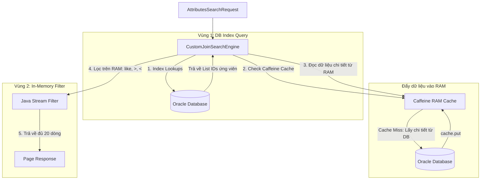

# Kế hoạch Triển khai: Custom Hash Join & Merge Join Engine (Giai đoạn 1)

Kế hoạch này tập trung vào việc thiết kế cấu trúc lưu trữ Hash Index trên RAM cho các trường có index (`id`, `sku`, `productId`, `statusProduct`) và thuật toán Merge Join Stateful phục vụ phân trang, kèm theo cơ chế tự động nạp dữ liệu (hydration) vào L1 Cache (Caffeine).

---

## 1. Cơ chế Chia 2 Vùng Xử lý và Đẩy dữ liệu vào RAM

Để thực hiện tìm kiếm tối ưu, câu truy vấn (Select) sẽ được chia làm **2 Vùng độc lập** dưới đây:

### Vùng 1: DB Index Query (Lọc theo các trường có Index để lấy IDs)
*   **Nhiệm vụ:** Chỉ thực hiện truy vấn các trường được đánh index trong Database để lấy về danh sách **ID ứng viên** thỏa mãn (giúp câu SQL chạy cực nhanh nhờ tận dụng B-Tree Index của DB).
*   **Ví dụ câu SQL sinh ra ở Vùng 1:** 
    ```sql
    SELECT a.id FROM Attributes a WHERE a.product_id = :productId AND a.status_product = :status
    ```
*   **Kết quả thu được:** Một danh sách ID thô: `List<Long> candidateIds = [102, 105, 110, 120]`.

---

### Cách đẩy kết quả Vùng 1 vào RAM Cache (Caffeine)
Sau khi có `candidateIds` từ Vùng 1, ta cần đẩy thông tin chi tiết của các ID này lên RAM để chuẩn bị cho Vùng 2 lọc tiếp. Quy trình đẩy vào RAM như sau:

1.  **Quét bộ nhớ đệm (RAM Cache Miss Check):**
    - Kiểm tra xem các ID `[102, 105, 110, 120]` đã có sẵn đối tượng chi tiết trong Caffeine L1 Cache hay chưa.
2.  **Đẩy vào RAM (Hydrate):**
    - Đối với những ID **chưa có** trên RAM (Cache Miss), ta thực hiện một câu SQL lấy thông tin chi tiết theo lô (Batch Load):
      ```sql
      SELECT a FROM Attributes a WHERE a.id IN (:missingIds)
      ```
    - Sau khi lấy được dữ liệu chi tiết từ DB, ta thực hiện đẩy chúng vào RAM cache (Caffeine) bằng lệnh:
      ```java
      cache.put(attribute.getId(), attributeDto);
      ```
    - Bây giờ, toàn bộ thông tin chi tiết (bao gồm cả các trường không index như `name`, `price`, `keywords`...) của tập ID ứng viên đã **nằm trọn vẹn trên RAM (Caffeine)**.

---

### Vùng 2: In-Memory Filter (Lọc trên RAM các điều kiện phức tạp còn lại)
*   **Nhiệm vụ:** Thực hiện lọc các điều kiện còn lại như `like`, `>`, `<` trực tiếp trên bộ nhớ RAM dựa vào dữ liệu chi tiết đã được đẩy lên RAM ở bước trên.
*   **Cách thực hiện:**
    - Duyệt qua danh sách `candidateIds` ứng viên.
    - Lấy thông tin chi tiết của từng phần tử từ RAM Cache (lúc này chắc chắn 100% là Cache Hit, tốc độ lấy đạt mức nano-giây).
    - Áp dụng các bộ lọc Java Stream để so khớp điều kiện:
      ```java
      List<AttributesDto> result = candidateIds.stream()
          .map(id -> cache.get(id)) // Lấy dữ liệu chi tiết cực nhanh từ RAM
          .filter(dto -> dto.getPrice() > minPrice) // Lọc điều kiện >
          .filter(dto -> dto.getName().toLowerCase().contains(keyword)) // Lọc điều kiện LIKE
          .limit(20) // Phân trang chỉ lấy đủ 20 dòng
          .toList();
      ```

---

## 2. Thiết kế Kiến trúc & Luồng xử lý tổng thể



---

## 3. Các thay đổi đề xuất (Proposed Changes)

Chúng ta sẽ tạo một thư mục gói mới `com.anno.ERP_SpringBoot_Experiment.service.Merchandise.search` để chứa các thành phần của công cụ tìm kiếm tùy chỉnh này.

### Component 1: `CustomIndexStore.java` [NEW]
*   **Vai trò:** Nơi lưu trữ duy nhất cho các Hash Map chỉ mục trên RAM.
*   **Các trường chỉ mục dự kiến:**
    - `Map<String, List<Long>> skuIndex`
    - `Map<Long, List<Long>> productIdIndex`
    - `Map<StockStatus, List<Long>> statusIndex`
*   **Tính năng:** Cung cấp các hàm thread-safe để thêm, xóa, cập nhật chỉ mục khi sản phẩm thay đổi.

### Component 2: `StatefulMergeJoinIterator.java` [NEW]
*   **Vai trò:** Iterator giữ trạng thái con trỏ để thực hiện Merge Join giao thoa giữa các danh sách ID tăng dần.

### Component 3: `CustomJoinSearchEngine.java` [NEW]
*   **Vai trò:** Lớp trung tâm tiếp nhận `AttributesSearchRequest`, tách các bộ lọc:
    - Sử dụng `CustomIndexStore` để lấy các danh sách ID ứng viên.
    - Dùng `StatefulMergeJoinIterator` để Merge Join.
    - Lấy thông tin từ Caffeine Cache qua `CacheUtils.getAll` để tự động nạp và lưu vào RAM Cache, sau đó áp dụng Java Streams filter nốt các trường `minPrice`, `maxPrice`, `keyword` (like).

### Component 4: `SearchTestController.java` [NEW]
*   **Vai trò:** Viết một endpoint REST thử nghiệm để kiểm chứng hiệu năng và tính đúng đắn của thuật toán (ví dụ: `/api/merchandise/custom-search`).

---

## 4. Kế hoạch xác minh (Verification Plan)

### Kiểm thử thủ công (Manual Verification)
1.  **Nạp dữ liệu thử nghiệm:** Tạo khoảng 1,000 variants (Attributes).
2.  **Gọi API custom-search:**
    - Gửi request chứa cả điều kiện index (`productId`, `status`) và điều kiện không index (`minPrice`, `keyword` like).
    - Xác minh số lượng phần tử trả về chính xác theo size phân trang (ví dụ: 20 dòng).
    - Kiểm tra logs hệ thống để xác nhận con trỏ Merge Join đã dừng lại ngay khi đủ 20 dòng (không quét toàn bộ 1,000 dòng).
3.  **Kiểm tra Cache Hydration:**
    - Lần gọi đầu tiên: Logs ghi nhận DB query được kích hoạt do Cache Miss (`Cache miss! Query DB lấy thông tin...`).
    - Lần gọi thứ hai: Không còn DB query nào, toàn bộ kết quả chi tiết được lấy trực tiếp từ Caffeine RAM Cache.
