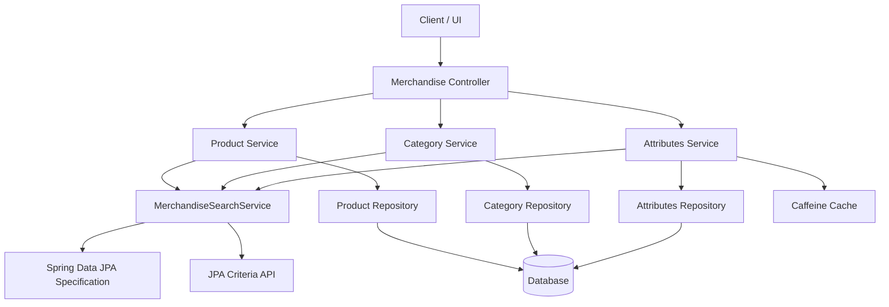
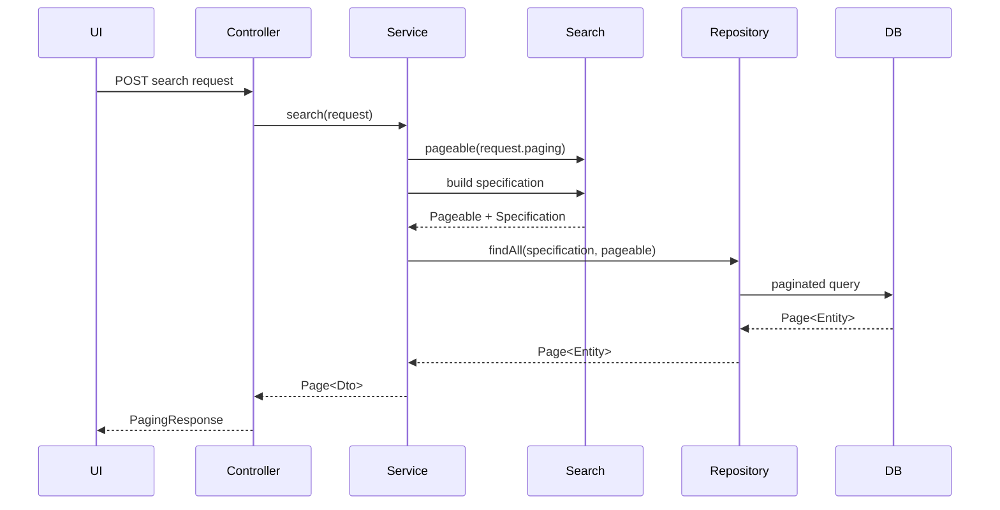
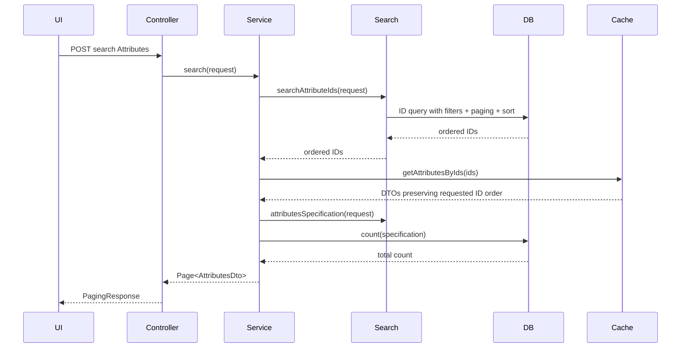

# Merchandise Search Upgrade Report

## System Summary

Merchandise search handles filtering and paginated lookup for three catalog domains:

- Category
- Product
- Attributes

The upgraded implementation keeps the public REST contracts stable while moving search construction into a shared internal module. The main goal is to make search behavior consistent, safer for invalid input, and easier to extend without growing the business services.

**Tech stack involved:**

- Java 21
- Spring Boot 3.x
- Spring Data JPA `Specification`
- JPA Criteria API
- Oracle-compatible persistence model
- Caffeine cache for batch detail hydration

## Public Entry Points

The endpoint URLs and request/response contracts remain unchanged.

| Domain | Endpoint | Request DTO | Response |
| --- | --- | --- | --- |
| Product | `POST /api/merchandise/search-Product` | `GetProductRequest` | `PagingResponse<ProductDto>` |
| Category | `POST /api/merchandise/search-Category` | `CategorySearchRequest` | `PagingResponse<CategoryDto>` |
| Attributes | `POST /api/merchandise/search-Attributes` | `AttributesSearchRequest` | `PagingResponse<AttributesDto>` |

The controller still delegates to the same domain services. The change is internal to service/search construction.

## High-Level Architecture



## Core Module Responsibilities

### Merchandise Search Module

`MerchandiseSearchService` is now the single module responsible for search construction.

Responsibilities:

- Build Category search `Specification`
- Build Product search `Specification`
- Build Attributes search `Specification`
- Build Attributes ID query with paging and sort
- Validate and normalize paging
- Parse numeric filter values safely
- Parse enum filter values safely
- Apply active/not-deleted filtering consistently

This module owns the query rules. Product, Category, and Attributes services no longer carry private JPA Criteria helper methods.

### Product Search

Product search still supports the broadest filter set:

- keyword
- category id
- product ids
- product SKUs
- status
- category ids
- sold quantity range
- revenue range
- order count range
- view count minimum
- rating minimum
- review count minimum
- created/updated time ranges
- created by

Keyword search still checks:

- product name
- product SKU
- attribute name
- attribute SKU
- attribute keywords

The Product service now only obtains a safe `Pageable`, asks the search module for a `Specification`, and delegates execution to the repository.

### Category Search

Category search supports:

- ids
- SKUs
- names
- keyword
- created by
- created/updated time ranges

The upgrade fixes the previous null-paging risk. If the client sends `paging = null`, the system now uses default page 1, size 10 instead of failing.

### Attributes Search

Attributes search keeps the existing two-step strategy:

1. Query matching Attributes IDs using JPA Criteria.
2. Hydrate `AttributesDto` details by ID through the existing cache-aware lookup path.

The upgrade fixes a key correctness issue: the ID query now applies sort from `PagingRequest`. That means cache hydration keeps the performance pattern, while the database still controls page order.

Supported filters:

- keyword
- ids
- product id
- product ids
- SKUs
- stock statuses
- price range
- sale price range
- sold quantity range
- cost price range
- created by
- created/updated time ranges

## Request Data Flow

### Product and Category Search



### Attributes Search



## Validation and Error Rules

### Paging

Default behavior:

- `paging = null` becomes page 1, size 10.

Validation:

- `page < 1` returns `VALIDATION_FAILED`.
- `size < 1` returns `VALIDATION_FAILED`.

This prevents accidental negative offsets or runtime paging errors.

### Numeric Filters

String IDs are parsed centrally.

Invalid numeric fields now produce `BusinessException` with `VALIDATION_FAILED` instead of raw `NumberFormatException`.

Affected filter groups:

- Category ids
- Product ids
- Category id filters in Product search
- Attributes ids
- Attributes product id filters

### Enum Filters

Status filters are parsed centrally.

Product statuses are parsed to `ActiveStatus`.

Attributes statuses are parsed to `StockStatus`.

Invalid status values now return `VALIDATION_FAILED`.

Enum parsing is case-insensitive, so values like `available` and `NOT_ACTIVE` are both acceptable for Attributes status.

## Active and Soft-Delete Rule

All three search domains share the same active/not-deleted predicate:

- `isDeleted` is null or false
- `deletedAt` is null or greater than current time

This keeps Category, Product, and Attributes search aligned.

## SpecificationBuilder Fix

The generic `SpecificationBuilder.with(String key, String operation, Object value)` method previously returned `this` without adding criteria.

It now adds a `SearchCriteria` just like the enum-operation overload.

Why this matters:

- Future code using the string-operation builder will not silently skip filters.
- Existing Category/Attributes specification behavior stays compatible.
- Test coverage now locks this behavior.

## Files Changed

| Area | File | Purpose |
| --- | --- | --- |
| Shared search module | `src/main/java/com/anno/ERP_SpringBoot_Experiment/service/Merchandise/MerchandiseSearchService.java` | Central search construction, validation, paging, sort |
| Product service | `src/main/java/com/anno/ERP_SpringBoot_Experiment/service/Merchandise/ProductService.java` | Delegates Product search to shared module |
| Category service | `src/main/java/com/anno/ERP_SpringBoot_Experiment/service/Merchandise/CategoryService.java` | Delegates Category search to shared module |
| Attributes service | `src/main/java/com/anno/ERP_SpringBoot_Experiment/service/Merchandise/AttributesService.java` | Delegates Attributes search and ID search to shared module |
| Specification helper | `src/main/java/com/anno/ERP_SpringBoot_Experiment/repository/specification/SpecificationBuilder.java` | Fixes string-operation `with(...)` no-op |
| Tests | `src/test/java/com/anno/ERP_SpringBoot_Experiment/service/Merchandise/MerchandiseSearchServiceTest.java` | Covers search validation and builder behavior |

## How to Extend Search

### Add a Product Filter

1. Add the filter field to `GetProductRequest`.
2. Add the specification rule in `MerchandiseSearchService.productSpecification`.
3. Use centralized helpers when possible:
   - `equalsLong`
   - `inLongList`
   - `inStringList`
   - `inEnumList`
   - `greaterThanOrEqualTo`
   - `lessThanOrEqualTo`
4. Add a unit test if the filter needs parsing or validation.

### Add a Category Filter

1. Add the filter field to `CategorySearchRequest`.
2. Add a `SearchCriteria` entry in `categorySpecification`.
3. Reuse `addComparableRange`, `parseLongList`, or `addIfNotEmpty`.
4. Keep active/not-deleted filtering inside the shared module.

### Add an Attributes Filter

1. Add the filter field to `AttributesSearchRequest`.
2. Add the corresponding criteria in the Attributes criteria builder.
3. If the new filter should affect sorting, ensure its property path is valid for JPA Criteria sorting.
4. Keep the two-step ID query + cache hydration flow unless there is a strong reason to bypass cache.

## Testing Coverage

Current test coverage added:

- null paging defaults to page 1, size 10
- invalid page is rejected
- invalid size is rejected
- numeric lists skip blank values and parse valid IDs
- invalid numeric IDs produce `VALIDATION_FAILED`
- enum status parsing is case-insensitive
- invalid enum status produces `VALIDATION_FAILED`
- `SpecificationBuilder.with(String, String, Object)` adds criteria

Verification commands used:

```bash
./mvnw -q -DskipTests compile
./mvnw -q -Dtest=MerchandiseSearchServiceTest test
./mvnw -q -DskipTests test-compile
```

## Remaining Recommendations

1. Add repository or integration tests for real JPA behavior, especially Product keyword search across Attributes.
2. Add HTTP controller tests for invalid search inputs returning clean API errors.
3. Consider sort-field whitelisting before exposing many arbitrary nested sort paths to UI.
4. Consider replacing string path criteria with typed query objects if search keeps growing.
5. Consider a separate `MerchandiseSearchQuery` model later if UI requirements diverge from current request DTOs.

## Troubleshooting

### Invalid ID Search Fails

Check that ID filters are numeric strings. Invalid values now intentionally return validation errors.

### Status Search Returns Validation Error

Use enum names, case-insensitive:

- Product status examples: `ACTIVE`, `LOCKED`
- Attributes status examples: `AVAILABLE`, `UNAVAILABLE`, `COMING_SOON`, `NOT_ACTIVE`

### Attributes Sort Looks Wrong

Confirm the requested sort property matches a real Attributes entity path. The ID query applies sort before cache hydration, and the hydrated DTO list preserves the ID order returned by the query.

### Deleted Items Still Appear

Search uses the shared active/not-deleted predicate. If deleted items appear, inspect the entity values for `isDeleted` and `deletedAt`; items with `deletedAt` in the future are still considered active during the soft-delete retention window.
