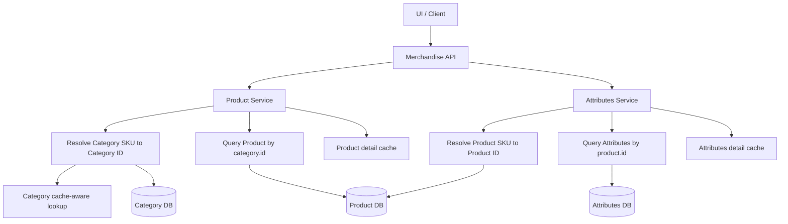
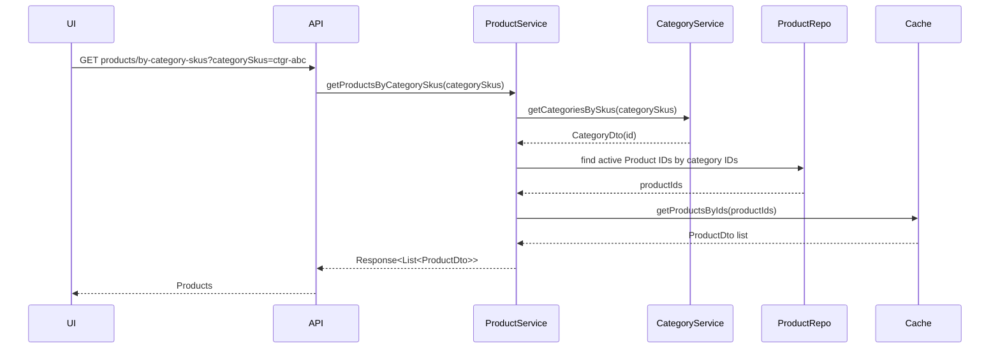
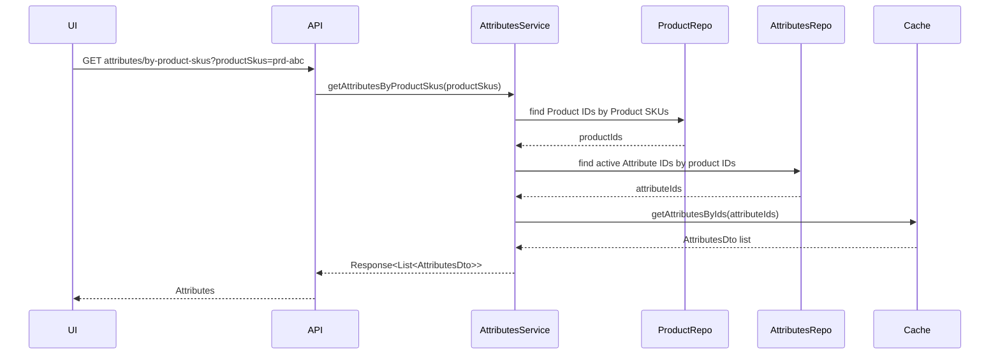
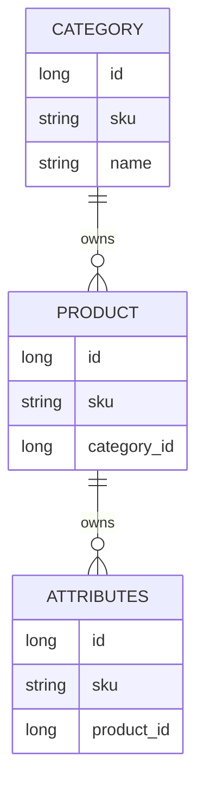

# Merchandise SKU Resolution Flow Report

## System Summary

Chuc nang Merchandise da duoc tinh chinh de UI co the thao tac bang SKU thay vi ID noi bo. Backend khong coi SKU quan he nhu field truc tiep tren entity con. Thay vao do, service se resolve SKU cua entity cha thanh ID that, sau do moi query entity con bang quan he database.

Pham vi nang cap gom:

- Product theo Category SKU
- Attributes theo Product SKU
- Search Product bang Category SKU
- Search Attributes bang Product SKU
- Cache-aware detail hydration sau khi da lay duoc danh sach ID that

Nguyen tac nghiep vu moi:

- Product khong luu `categorySku`; Product chi lien ket voi Category qua `category.id`.
- Attributes khong luu `productSku`; Attributes chi lien ket voi Product qua `product.id`.
- SKU la public identifier cho UI/API.
- ID noi bo van la khoa query chinh trong DB.

## Public Entry Points

| Chuc nang | Endpoint | Input public | Ket qua |
| --- | --- | --- | --- |
| Get Product by Category SKU | `GET /api/merchandise/products/by-category-skus` | `categorySkus` | Danh sach Product |
| Search Product by Category SKU | `POST /api/merchandise/search-Product` | `categorySku`, `categorySkus` | Page Product |
| Get Attributes by Product SKU | `GET /api/merchandise/attributes/by-product-skus` | `productSkus` | Danh sach Attributes |
| Search Attributes by Product SKU | `POST /api/merchandise/search-Attributes` | `productSku`, `productSkus` | Page Attributes |

Request body search Product co the dung:

```json
{
  "categorySku": "ctgr-abc"
}
```

hoac:

```json
{
  "categorySkus": ["ctgr-abc", "ctgr-def"]
}
```

Request body search Attributes co the dung:

```json
{
  "productSku": "prd-abc"
}
```

hoac:

```json
{
  "productSkus": ["prd-abc", "prd-def"]
}
```

## High-Level Architecture



## Product by Category SKU Flow

### Get Product by Category SKU



Thuat toan:

1. Loc bo SKU rong.
2. Resolve Category SKU thanh Category ID bang Category service.
3. Neu khong resolve duoc Category nao thi tra ve danh sach rong.
4. Query Product IDs bang `category.id`.
5. Goi lai ham lay Product theo IDs de tan dung cache detail.
6. Tra ve Product DTO.

### Search Product by Category SKU

Search Product van dung chung search specification hien co. Diem moi la service them mot tang resolve truoc khi build query cuoi:

1. Doc `categorySku` va `categorySkus` tu request.
2. Resolve sang Category IDs.
3. Neu client gui Category SKU nhung khong tim thay Category nao thi tra ve page rong.
4. Build Product specification nhu cu.
5. Them dieu kien `category.id IN resolvedCategoryIds`.
6. Query Product page bang Spring Data JPA.

## Attributes by Product SKU Flow

### Get Attributes by Product SKU



Thuat toan:

1. Loc bo Product SKU rong.
2. Resolve Product SKU thanh Product ID bang repository query lay cap `productId + sku`.
3. Neu khong resolve duoc Product nao thi tra ve danh sach rong.
4. Query Attribute IDs bang `product.id`.
5. Goi lai ham lay Attributes theo IDs de di qua cache `attributes`.
6. Tra ve Attributes DTO.

Quan trong: service khong query Attributes bang `productSku`, vi Attributes khong co field do. Product SKU chi la dau vao public de resolve sang Product ID.

### Search Attributes by Product SKU

Search Attributes co them tang resolve truoc khi tao query:

1. Doc `productSku` va `productSkus` tu request.
2. Resolve sang Product IDs.
3. Neu client gui Product SKU nhung khong tim thay Product nao thi tra ve page rong.
4. Merge Product IDs resolve duoc vao filter `productIds`.
5. Dung search Attributes specification hien co de query Attribute IDs theo paging/sort.
6. Hydrate DTO bang `getAttributesByIds`.
7. Count total bang cung specification da duoc merge Product IDs.

## Data Model Rule



Khong co cot:

- `product.categorySku`
- `attributes.productSku`

Do do moi chuc nang public theo SKU cua entity cha deu phai resolve qua ID truoc.

## Error and Empty Result Behavior

| Truong hop | Hanh vi |
| --- | --- |
| Input SKU null hoac rong | Tra ve danh sach rong |
| SKU hop le format nhung khong resolve duoc entity cha | Tra ve danh sach/page rong |
| SKU resolve duoc nhung entity con khong co data | Tra ve danh sach/page rong |
| Search co them filter khac | Filter SKU cha duoc AND voi cac filter con lai |

## Cache Behavior

Product by Category SKU:

1. Resolve Category SKU.
2. Query Product IDs theo Category IDs.
3. Hydrate Product DTO qua ham get Product by IDs.
4. Ham get Product by IDs dung cache `productDetails`, cache miss moi query DB.

Attributes by Product SKU:

1. Resolve Product SKU.
2. Query Attribute IDs theo Product IDs.
3. Hydrate Attributes DTO qua ham get Attributes by IDs.
4. Ham get Attributes by IDs dung cache `attributes`, cache miss moi query DB.

Loi can tranh: khong goi truc tiep method co `@Cacheable` trong cung mot service de mong Spring proxy apply cache. Flow moi dung ham batch get-by-IDs de cache-aware mot cach chu dong.

## Implementation Pattern

Pattern chuan cho cac API public dung SKU cha:

```text
public parent SKU input
    -> filter blank / trim / distinct
    -> resolve parent SKU to parent ID
    -> if no resolved ID, return empty result
    -> query child IDs by parent ID
    -> hydrate child DTOs through cache-aware get-by-IDs
```

Pattern search:

```text
search request with parent SKU
    -> resolve parent SKU to parent ID
    -> merge resolved IDs into existing child search filters
    -> build specification using real DB relationship fields
    -> query IDs/page
    -> hydrate DTOs through cache-aware path
```

## Regression Coverage

Da them test hoi quy cho:

- Product by Category SKU phai resolve Category IDs truoc khi query Product.
- Product by Category SKU tra rong khi Category SKU khong resolve duoc.
- Attributes by Product SKU phai resolve Product IDs truoc khi query Attributes.
- Attributes by Product SKU tra rong khi Product SKU khong resolve duoc.

Các test này khoa lai rule quan trong: khong filter entity con bang SKU cua entity cha nhu the field do ton tai tren bang con.

