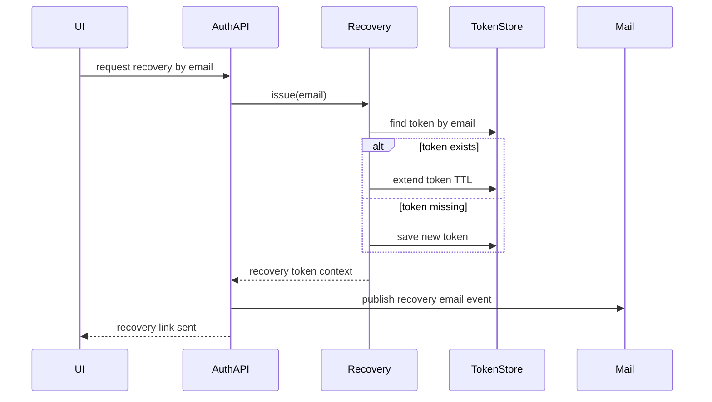
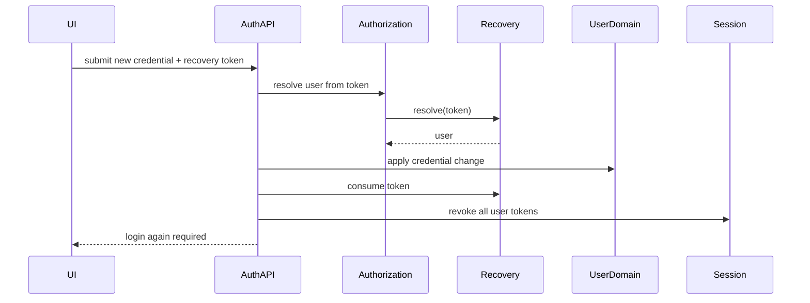
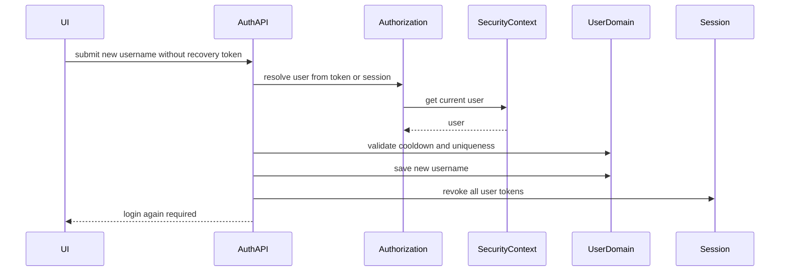

# User Account Recovery and Credential Change Report

## Purpose

Tài liệu này mô tả phần nâng cấp mới của nhóm chức năng User: khôi phục tài khoản, xác thực recovery token, đổi mật khẩu, đổi tên đăng nhập, và xử lý token sau khi đổi thông tin đăng nhập.

Tài liệu được viết để AI agent hoặc developer ở dự án khác có thể hiểu nghiệp vụ mà không cần phụ thuộc vào cấu trúc thư mục nội bộ của dự án hiện tại.

## Business Goal

Người dùng có thể đổi thông tin đăng nhập theo hai ngữ cảnh:

1. Người dùng đang đăng nhập bằng session/JWT hợp lệ.
2. Người dùng không đăng nhập nhưng đi qua luồng "quên thông tin đăng nhập" bằng recovery token gửi qua email.

UI không cần gửi user id. User luôn được xác định từ một trong hai nguồn tin cậy:

- Recovery token.
- Authenticated session hiện tại.

Sau khi đổi thông tin đăng nhập thành công, hệ thống buộc người dùng đăng nhập lại.

## Key Concepts

### Recovery Token

Recovery token là token dùng một lần cho luồng khôi phục tài khoản. Token được gửi qua email dưới dạng link cho người dùng.

Recovery token có TTL 24 giờ.

Recovery token được lưu theo hai chiều:

- token -> email
- email -> token

Cách lưu hai chiều giúp hệ thống:

- validate token để tìm ra user
- reuse token cũ nếu user request nhiều lần trong thời gian token còn hạn
- xóa đầy đủ token sau khi dùng xong

### Credential Change Authorization

Đây là tầng xử lý mới trước khi chạy nghiệp vụ đổi thông tin đăng nhập.

Nhiệm vụ của tầng này:

- Nếu request có recovery token, resolve user từ recovery token.
- Nếu request không có recovery token, resolve user từ session hiện tại.
- Trả về user đã được xác thực quyền đổi thông tin.
- Ghi nhớ request này đến từ recovery token hay session để xử lý token sau nghiệp vụ.

### Account Recovery

Account Recovery là module quản lý vòng đời recovery token:

- phát hành token
- gia hạn token cũ
- validate token
- consume token sau khi dùng

Module này che giấu chi tiết Redis key, TTL, và cách xóa token. Các nghiệp vụ User không cần biết token được lưu như thế nào.

## Supported User Flows

### Flow 1: Request Account Recovery

Người dùng nhập email ở UI quên thông tin đăng nhập.

Hệ thống xử lý:

1. Tìm user theo email.
2. Chỉ cho phép user có trạng thái active.
3. Nếu email đã có recovery token còn hạn, hệ thống reuse token đó và gia hạn TTL lên 24 giờ.
4. Nếu chưa có token, hệ thống tạo token mới.
5. Hệ thống publish email event sau khi transaction commit.
6. Email gửi cho user chứa link đến UI reset password kèm token.

Kết quả trả về cho UI:

- Không trả user id.
- Không trả recovery token trực tiếp trong response.
- Chỉ trả message thông báo link khôi phục đã được gửi đến email đã mask.

### Flow 2: Validate Recovery Token

UI gọi validate token trước khi hiện form đổi thông tin.

Hệ thống xử lý:

1. Nhận recovery token từ query parameter.
2. Kiểm tra token có tồn tại và còn hạn hay không.
3. Lấy email từ token.
4. Tìm user theo email.
5. Trả về thông tin user tối thiểu cho UI.
6. User id bị set null trước khi trả về.

Mục tiêu:

- UI có thể hiển thị thông tin nhận diện như username/email.
- UI không cần và không được phụ thuộc vào user id.

### Flow 3: Reset Password By Recovery Token

Người dùng mở link recovery và nhập mật khẩu mới.

Hệ thống xử lý:

1. Resolve user từ recovery token.
2. Validate password mới và confirm password.
3. Encode password mới.
4. Lưu password mới.
5. Consume recovery token.
6. Revoke toàn bộ session/refresh token của user.
7. Trả về message yêu cầu user đăng nhập lại.

Điểm bảo mật quan trọng:

- Recovery token bị xóa ngay sau khi đổi password thành công.
- Recovery token không còn sống đến hết TTL sau khi đã dùng.
- Session cũ bị revoke để tránh user tiếp tục dùng credential cũ.

### Flow 4: Change Username While Logged In

Người dùng đang đăng nhập và đổi username.

Hệ thống xử lý:

1. Request không cần gửi recovery token.
2. Hệ thống lấy user từ session hiện tại.
3. Kiểm tra cooldown đổi username.
4. Kiểm tra username mới chưa tồn tại.
5. Lưu username mới.
6. Đặt cooldown 30 ngày.
7. Revoke toàn bộ session/refresh token.
8. Trả về message yêu cầu đăng nhập lại.

### Flow 5: Change Username By Recovery Token

Người dùng không đăng nhập nhưng đi qua luồng quên thông tin đăng nhập.

Hệ thống xử lý:

1. Request gửi recovery token trong body.
2. Hệ thống resolve user từ recovery token.
3. Kiểm tra cooldown đổi username.
4. Kiểm tra username mới chưa tồn tại.
5. Lưu username mới.
6. Đặt cooldown 30 ngày.
7. Consume recovery token.
8. Revoke toàn bộ session/refresh token.
9. Trả về message yêu cầu đăng nhập lại.

Điểm chính:

- UI không gửi user id.
- Recovery token đóng vai trò chứng minh quyền đổi username.
- Token bị kill sau khi đổi xong.

## Endpoint Contracts

### Request Account Recovery

```http
GET /api/auth/recover-account/{email}
```

Input:

- `email`: email tài khoản cần khôi phục.

Success behavior:

- Tạo hoặc gia hạn recovery token.
- Gửi email recovery.
- Trả message đã gửi link khôi phục.

Failure behavior:

- User không tồn tại: trả lỗi user not found.
- User chưa active: trả lỗi invalid credentials.

### Validate Recovery Token

```http
GET /api/auth/validate-reset-token?token={recoveryToken}
```

Input:

- `token`: recovery token từ email.

Success behavior:

- Trả thông tin user tối thiểu.
- Không trả user id.

Failure behavior:

- Token thiếu, sai, hoặc hết hạn: trả lỗi invalid credentials.
- Token trỏ tới user không còn tồn tại: trả lỗi user not found.

### Reset Password

```http
POST /api/auth/reset-password?code={recoveryToken}
```

Body:

```json
{
  "newPassword": "new-password",
  "confirmPassword": "new-password"
}
```

Success behavior:

- Đổi password.
- Consume recovery token.
- Revoke toàn bộ session/refresh token.
- Yêu cầu user đăng nhập lại.

Failure behavior:

- Token thiếu, sai, hoặc hết hạn.
- Password mới thiếu.
- Confirm password không khớp.

### Change Username

```http
PUT /api/auth/change-username
```

Body khi user đang đăng nhập:

```json
{
  "newUsername": "new_username"
}
```

Body khi user dùng recovery token:

```json
{
  "token": "recovery-token-from-email",
  "newUsername": "new_username"
}
```

Success behavior:

- Đổi username.
- Nếu có recovery token thì consume token.
- Revoke toàn bộ session/refresh token.
- Đặt cooldown đổi username 30 ngày.
- Yêu cầu user đăng nhập lại.

Failure behavior:

- Không có token và cũng không có session hợp lệ.
- Token sai hoặc hết hạn.
- Username mới đã tồn tại.
- User đang trong thời gian cooldown.

## Token Lifecycle Rules

### Recovery Token Creation

Nếu email chưa có recovery token còn hạn:

1. Tạo UUID token mới.
2. Lưu token -> email với TTL 24 giờ.
3. Lưu email -> token với TTL 24 giờ.

### Recovery Token Reuse

Nếu email đã có recovery token còn hạn:

1. Không tạo token mới.
2. Gia hạn token hiện tại lên 24 giờ.
3. Gửi lại email với token hiện tại.

Lý do:

- Tránh tạo nhiều link recovery song song.
- Giảm rủi ro người dùng dùng nhầm link cũ/mới.
- Giữ một nguồn sự thật cho recovery token hiện tại của email.

### Recovery Token Consumption

Sau khi đổi thông tin đăng nhập thành công bằng recovery token:

1. Xóa mapping token -> email.
2. Xóa mapping email -> token.
3. Token không thể dùng lại.

Luật này áp dụng cho:

- reset password
- change username bằng recovery token

### Session Revocation

Sau khi đổi thông tin đăng nhập thành công:

1. Xóa access token/session cache của user.
2. Xóa toàn bộ refresh token của user.
3. User phải đăng nhập lại bằng thông tin mới.

Luật này áp dụng cho:

- reset password bằng recovery token
- change username bằng recovery token
- change username khi đang login

## Security Rules

1. UI không được thao tác bằng user id cho credential change.
2. Recovery token là proof để đổi thông tin khi user chưa login.
3. Authenticated session là proof để đổi thông tin khi user đang login.
4. Recovery token chỉ dùng một lần.
5. Recovery token không được giữ lại sau khi đổi thành công.
6. Mọi session cũ phải bị revoke sau khi đổi credential.
7. Response validate token không được expose user id.
8. Username mới phải unique.
9. Username change bị giới hạn bởi cooldown 30 ngày.
10. Account recovery chỉ áp dụng cho tài khoản active.

## Sequence Diagrams

### Account Recovery Request



### Credential Change With Recovery Token



### Change Username While Logged In



## Implementation Responsibilities

### Account Recovery Module

Owns:

- recovery token TTL
- recovery token generation
- token reuse policy
- token validation
- token consumption
- Redis key convention through a token store adapter

Does not own:

- password encoding
- username validation
- response DTO mapping
- email rendering
- UI routing

### Credential Change Authorization Layer

Owns:

- choosing the authorization source
- resolving user from recovery token
- resolving user from current session
- telling the caller whether recovery token cleanup is required

Does not own:

- actual credential mutation
- password encoding
- username uniqueness check
- cooldown policy

### User Credential Business Logic

Owns:

- password equality validation
- password encoding and persistence
- username uniqueness validation
- username cooldown enforcement
- session revocation after successful credential change

Does not own:

- Redis recovery token key format
- token TTL
- token lookup internals

## Data and Side Effects

### Redis Side Effects

Account recovery creates or updates:

- token-to-email mapping with 24-hour TTL
- email-to-token mapping with 24-hour TTL

Credential change may delete:

- token-to-email mapping
- email-to-token mapping
- user session/access token cache
- user refresh token collection

Username change creates:

- username cooldown marker with 30-day TTL

### Database Side Effects

Password reset updates:

- encoded password field

Username change updates:

- username field

No user id is required from the client.

### Email Side Effects

Account recovery publishes an email event after the recovery token is issued.

The email contains a frontend URL with the recovery token as a query parameter.

## Error Cases

| Case | Expected Result |
| --- | --- |
| Email does not belong to any user | User not found error |
| User is inactive | Invalid credentials error |
| Recovery token is blank | Invalid credentials error |
| Recovery token is expired | Invalid credentials error |
| Recovery token points to missing user | User not found error |
| New password is missing | Invalid credentials error |
| Confirm password does not match | Invalid credentials error |
| New username already exists | Invalid credentials error |
| Username cooldown is active | Invalid credentials error |
| No recovery token and no logged-in session | User not found/auth error |

## Test Coverage Added

The new tests cover:

- resolving user from recovery token
- rejecting blank recovery token
- rejecting expired recovery token
- fallback to current session when no recovery token exists
- consuming recovery token after use
- issuing a new recovery token
- reusing and extending an existing recovery token
- rejecting account recovery for inactive users
- resolving recovery token into user context

## Behavior Preserved

Existing endpoint URLs remain stable.

Existing UI reset-password flow remains compatible:

- token still arrives through the reset password URL
- password body shape remains unchanged

Existing logged-in username change flow remains compatible:

- user can still submit only a new username
- session is now revoked after success

## Behavior Changed

Recovery token no longer remains valid after a successful credential change.

Username change now supports recovery-token mode for users who are not logged in.

The username change endpoint is reachable without authentication, but the business logic still requires either:

- a valid recovery token, or
- a valid authenticated session.

This is intentional because the recovery-token flow starts before login.

## Guidance For Another AI Agent

When extending this feature, preserve these invariants:

1. Never require user id from UI for credential change.
2. Always resolve user from trusted proof before mutation.
3. Treat recovery token as one-time action authorization.
4. Consume recovery token only after successful mutation.
5. Revoke sessions after credential mutation.
6. Keep token storage details behind the account recovery module.
7. Do not expose user id from token validation responses.

Recommended next enhancements:

1. Add a dedicated endpoint for changing password while logged in.
2. Replace generic invalid-credentials errors with more specific security-safe error codes.
3. Move account recovery email payload away from full User entity into an immutable notification command.
4. Add integration tests for the full recovery-token flow through HTTP.
5. Consider adding access-token blacklist or token versioning if immediate JWT invalidation is required.
