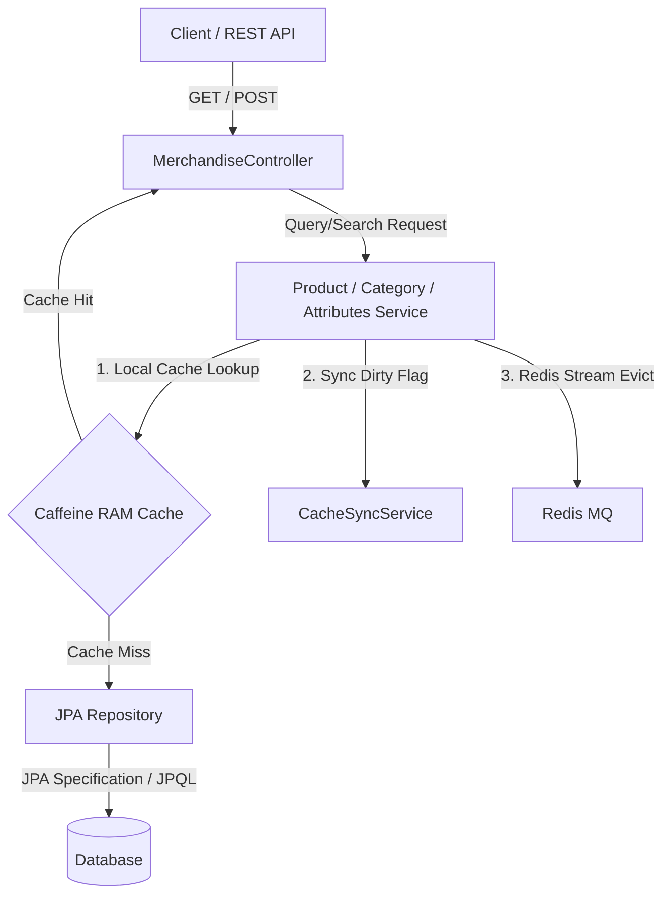
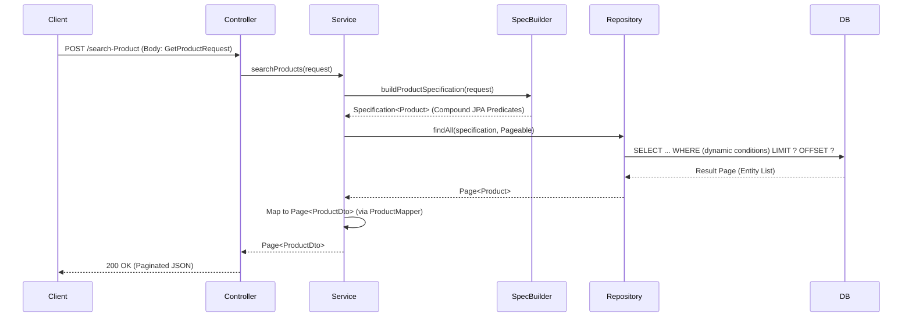
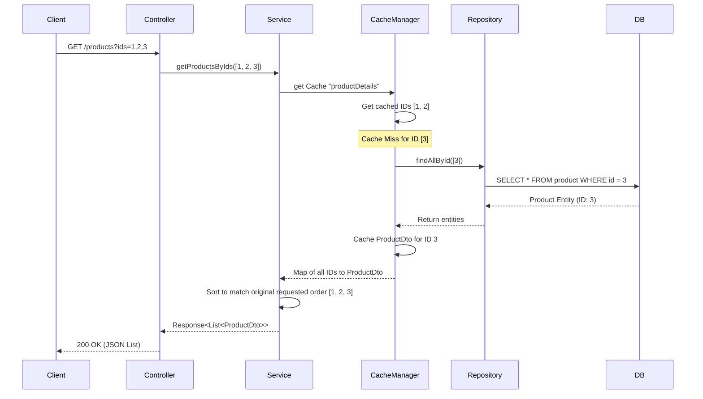

# Merchandise Retrieval API Architecture & Endpoint Report

This report provides a detailed architectural overview of the retrieval and search endpoints for **Products**, **Categories**, and **Attributes** in the Spring Boot ERP application. It maps the controllers, services, repositories, cache design, data flow, and dynamic query mechanisms.

---

## 1. System Overview & Tech Stack

The Merchandise Management module manages physical inventory types, categories, and item variations. It is built using:
- **Backend Framework:** Spring Boot 3.x
- **Persistence Layer:** Spring Data JPA with Hibernate ORM
- **Database Querying:** Dynamic **JPA Specifications** (replacing Elasticsearch for direct database search)
- **Caching Layer:** 
  - **Local Memory Cache:** Caffeine Cache (`cacheManager` config) for ultra-fast RAM read hits.
  - **Distributed Eviction:** Redis Pub/Sub or Streams via `RedisProducerService` to evict cache entries across cluster nodes.
- **API Documentation:** Swagger / OpenAPI 3 annotations (`@Tag`, `@Operation`).
- **Data Mapping:** MapStruct (`ProductMapper`, `CategoryMapper`, `AttributesMapper`).

---

## 2. High-Level Architecture Diagram

The system employs a layered architecture optimized for read performance using cached lookup methods:



---

## 3. Directory & Module Structure

The relevant files for these endpoints are organized as follows:

```
src/main/java/com/anno/ERP_SpringBoot_Experiment/
├── web/rest/
│   ├── MerchandiseController.java       # Controller Interface defining URL routes
│   └── impl/
│       └── merchandiseControllerImpl.java  # REST Controller Implementation
├── service/Merchandise/
│   ├── ProductService.java              # Product Business Logic & Cache sync
│   ├── CategoryService.java             # Category Business Logic & Soft Delete cleanups
│   └── AttributesService.java           # Attributes/Variants Business Logic
├── repository/
│   ├── ProductRepository.java           # JPA queries with JOIN FETCH
│   ├── CategoryRepository.java          # Soft delete and SKU lookup
│   ├── AttributesRepository.java        # Variant options and price bounds
│   └── specification/
│       ├── SearchCriteria.java          # Search query metadata
│       └── SpecificationBuilder.java    # Dynamic JPA specification builder
└── service/dto/
    ├── request/
    │   ├── GetProductRequest.java       # Product Search Request Body
    │   ├── CategorySearchRequest.java   # Category Search Request Body
    │   ├── AttributesSearchRequest.java # Attributes Search Request Body
    │   └── PagingRequest.java           # Pagination & Sorting mapping
    ├── ProductDto.java                  # Product response DTO
    ├── CategoryDto.java                 # Category response DTO
    └── AttributesDto.java               # Attributes response DTO
```

---

## 4. REST Entry Points Reference

All retrieval endpoints use the base path `/api/merchandise`.

### A. Product Retrieval Endpoints

| HTTP Method | Endpoint | Description | Input Parameters / Body |
| :--- | :--- | :--- | :--- |
| `POST` | `/api/merchandise/search-Product` | Searches products with complex filters and pagination | `GetProductRequest` (JSON Body) |
| `GET` | `/api/merchandise/products` | Gets list of products by numerical IDs (RAM cache friendly) | `@RequestParam List<Long> ids` |
| `GET` | `/api/merchandise/products/by-skus` | Gets list of products by SKU strings | `@RequestParam List<String> skus` |
| `GET` | `/api/merchandise/checkProduct/{name}` | Checks if a product exists by its exact name | `@PathVariable String name` |

### B. Category Retrieval Endpoints

| HTTP Method | Endpoint | Description | Input Parameters / Body |
| :--- | :--- | :--- | :--- |
| `POST` | `/api/merchandise/search-Category` | Searches categories with pagination and filters | `CategorySearchRequest` (JSON Body) |
| `GET` | `/api/merchandise/categories` | Gets list of categories by numerical IDs | `@RequestParam List<Long> ids` |
| `GET` | `/api/merchandise/categories/by-skus` | Gets list of categories by SKU strings | `@RequestParam List<String> skus` |
| `GET` | `/api/merchandise/checkCategory/{name}` | Checks if a category exists by its exact name | `@PathVariable String name` |

### C. Attributes/Variants Retrieval Endpoints

| HTTP Method | Endpoint | Description | Input Parameters / Body |
| :--- | :--- | :--- | :--- |
| `POST` | `/api/merchandise/search-Attributes` | Searches attributes with complex bounds & filters | `AttributesSearchRequest` (JSON Body) |
| `GET` | `/api/merchandise/attributes` | Gets list of attributes/variants by IDs | `@RequestParam List<Long> ids` |
| `GET` | `/api/merchandise/attributes/by-skus` | Gets list of attributes/variants by SKU strings | `@RequestParam List<String> skus` |

---

## 5. Data Flow Diagrams

### Search and Query Flow (Dynamic JPA Specification)
When a client hits `/search-Product`, `/search-Category` or `/search-Attributes`, a dynamic SQL statement is constructed based on search criteria:



### Cached ID Lookup Flow (Caffeine Cache + DB Fallback)
For batch fetches by IDs (`/api/merchandise/products?ids=1,2,3`), local RAM Caffeine caching is prioritized:



---

## 6. Common Patterns & Implementations

### A. Dynamic JPA Specification Pattern
Instead of writing separate SQL queries for each combination of query parameters, the services utilize a custom `SpecificationBuilder` and `SearchCriteria` matching:

```java
// Example from CategoryService.java
List<SearchCriteria> list = new ArrayList<>();
if (!names.isEmpty()) {
    list.add(new SearchCriteria("name", "~", names));
}
if (!skus.isEmpty()) {
    list.add(new SearchCriteria("skuInfo.sku", "~", skus));
}
// Returns a compound JPA Specification
Specification<Category> spec = new SpecificationBuilder<Category>(list).build();
return categoryRepository.findAll(spec, pageable);
```

### B. Batch Cached Retrieval Pattern (`CacheUtils.getAll`)
To perform bulk cache queries efficiently, the project wraps the Caffeine cache manager in a custom `CacheUtils` tool:

```java
// Example from AttributesService.java
Map<Long, AttributesDto> dtoMap = CacheUtils.getAll(
        cacheManager,
        CacheConfig.CACHE_ATTRIBUTES,
        ids,
        missingIds -> attributesRepository.getQuantityAttributesById(new ArrayList<>(missingIds)).stream()
                .collect(Collectors.toMap(Attributes::getId, attributesMapper::toDto))
);
```

### C. Soft Delete Filtering (30-day Window)
The entity entries are not deleted directly. Instead, when a delete request is processed, a future expiry date (`LocalDateTime.now().plusDays(30)`) is stamped onto `deletedAt`. Retrieval query layers check `deletedAt IS NULL` to filter out deleted rows:

```java
@Query("SELECT a FROM Attributes a WHERE a.product.id = :productId AND a.deletedAt IS NULL")
List<Attributes> findAllByProductIdNotDeleted(@Param("productId") Long productId);
```
Expired records are purged permanently via daily schedule triggers (`deleteAllExpiredProducts()`, etc.).

---

## 7. How-To Guides

### How to Add a New Filter to Product Search
1. Add the field to [GetProductRequest.java](file:///home/ddicgegd/Projects/erp_springboot-experiment/src/main/java/com/anno/ERP_SpringBoot_Experiment/service/dto/request/GetProductRequest.java):
   ```java
   private Double minDiscount;
   ```
2. Modify the specification building method `buildProductSpecification` in [ProductService.java](file:///home/ddicgegd/Projects/erp_springboot-experiment/src/main/java/com/anno/ERP_SpringBoot_Experiment/service/Merchandise/ProductService.java):
   ```java
   if (request.getMinDiscount() != null) {
       builder.with("discountPercent", SearchOperation.GREATER_THAN, request.getMinDiscount());
   }
   ```

### How to Evict Cache Manually when a Product Changes
If you modify product details directly outside standard update APIs, emit an eviction command to notify both the local Caffeine cache and other instances in the cluster:
```java
// Evict locally & publish Redis Stream event to cluster
redisProducerService.sendEvictMessage(productId.toString());
// Mark local RAM dirty
cacheSyncService.markProductDirty(productId);
```

---

## 8. Key Files Reference Table

| File | Purpose | Key Modification Context |
| :--- | :--- | :--- |
| [MerchandiseController.java](file:///home/ddicgegd/Projects/erp_springboot-experiment/src/main/java/com/anno/ERP_SpringBoot_Experiment/web/rest/MerchandiseController.java) | API Endpoint mappings | Changing URLs, Swagger annotations, adding new API routes |
| [ProductService.java](file:///home/ddicgegd/Projects/erp_springboot-experiment/src/main/java/com/anno/ERP_SpringBoot_Experiment/service/Merchandise/ProductService.java) | Product lookup & filter logics | Changing search spec builders, caching policies |
| [CategoryService.java](file:///home/ddicgegd/Projects/erp_springboot-experiment/src/main/java/com/anno/ERP_SpringBoot_Experiment/service/Merchandise/CategoryService.java) | Category business logic | Expiry handling, category mapping modifications |
| [AttributesService.java](file:///home/ddicgegd/Projects/erp_springboot-experiment/src/main/java/com/anno/ERP_SpringBoot_Experiment/service/Merchandise/AttributesService.java) | Variation & SKU attributes matching | Pricing rules, variant definitions |
| [ProductRepository.java](file:///home/ddicgegd/Projects/erp_springboot-experiment/src/main/java/com/anno/ERP_SpringBoot_Experiment/repository/ProductRepository.java) | Database Product entities queries | Optimizing queries with custom `@Query` joins |

---

## 9. Critical Dependencies & Configs

The following libraries directly affect retrieval speeds:
- `caffeine` - Local memory cache engine.
- `spring-boot-starter-data-jpa` - Relational mapping and SQL compilation.
- `lettuce-core` - Redis client for cache eviction message broker.

Caching TTL and sizes are configured globally inside the project's Cache Configuration files.

---

## 10. Troubleshooting Cache / Query Inconsistencies

#### 1. "I updated a Product, but the GET `/products?ids=...` endpoint still returns old data."
- **Cause:** Caffeine cache is still returning the older entry, and the update event did not successfully trigger eviction.
- **Fix:** Verify if `redisProducerService.sendEvictMessage()` completed. If running a standalone local environment without Redis cluster, confirm that the cache manager has evict bindings configured, or invoke `@CacheEvict(value = "productDetails", key = "#id")` directly.

#### 2. "Category query throws a BusinessException: CATEGORY_NOT_FOUND."
- **Cause:** The category was soft-deleted (`deletedAt` timestamp set) or the SKU lookup string mismatch.
- **Fix:** Confirm if the category exists in the DB and check if `deletedAt` is populated. If `deletedAt` is set, it will be ignored by default in active queries and automatically deleted from the DB after 30 days.
